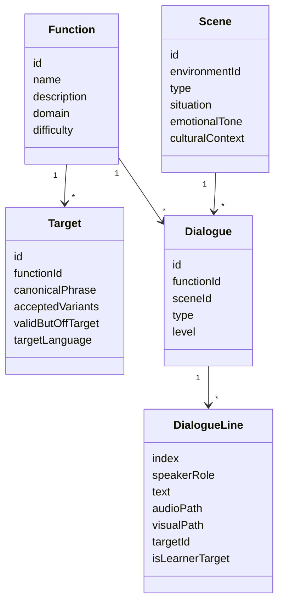
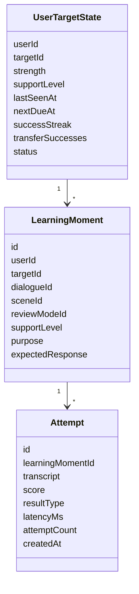

# Learning System Architecture

This document records the intended architecture for moving from static dialogue cards to adaptive language-learning sessions.

## Core Shape

The app should feel to the user like a sequence of tiny lived moments. Under the hood, it schedules learning targets, not whole dialogues.

```text
Content Authoring
  -> Content Graph
  -> Learning Engine
  -> Session Plan
  -> App Runtime
  -> Attempt Scoring
  -> Memory Update
```

## Domain Concepts

- **Function**: communicative job, such as greeting, asking price, refusing politely, or asking for help.
- **Target**: phrase/chunk/function the learner is practicing, with canonical response and accepted variants.
- **Scene**: visual/social context, such as study room, market stall, airport counter, or school hallway.
- **Dialogue**: concrete exchange inside one scene.
- **Anchor dialogue**: first vivid stable scene for a target.
- **Extension dialogue**: same anchor, one new conversational move.
- **Transfer dialogue**: same function in a different context.
- **Review mode**: task format, such as echo, produce from visual, missing line, response cue, transfer, or free response.
- **Learning moment**: one scheduled user-facing task that combines a target, scene/dialogue, review mode, and support level.

## Content Graph



## User Learning State



## Session Planner

Normal session:

1. Warm return with one easy familiar scene.
2. Review due targets.
3. Recover rusty targets.
4. Test one transfer scene.
5. Add a new anchor or extension only if review load is healthy.
6. End with a successful production moment.

Long-break session:

1. Start with familiar anchors.
2. Test recognition or visual-only production.
3. Increase support if rusty.
4. Pause new content unless performance is strong.
5. Rebuild intervals from current performance.

Default mix:

```text
60% due review
25% new or extended content
15% transfer or playful challenge
```

## Review Modes

Support ladder:

1. Full model: hear line and see visual.
2. Echo: hear line, repeat it.
3. Visual cue: see scene, produce line.
4. Response cue: hear reply, infer your line.
5. Transfer: same function in a new scene.
6. Free response: respond naturally.

Meaning-cued production prompts are not part of the default same-session first exposure flow. Keep them available for the learning engine as delayed review, rescue, or calibration steps after the learner has already attempted scene recall.

## Scoring Layers

Attempt results should distinguish:

- `exact_target`
- `accepted_variant`
- `same_function_off_target`
- `valid_but_wrong_mode`
- `wrong_function`
- `no_response`

This handles natural-language non-determinism without making beginner practice ambiguous.

## Build Order

1. Content graph models and loader.
2. Existing API served through content graph.
3. Learning moment and review mode schema.
4. Session planner with simple deterministic rules.
5. User target state persistence.
6. Attempt scoring and memory updates.
7. Authoring tools for anchors, extensions, transfers, storyboards, audio, and visuals.

## Product Rule

Do not use live LLM generation for beginner runtime cards. Use LLMs offline to generate candidates, variants, storyboards, and content metadata. Ship curated structured content to keep scheduling, review, visuals, audio, and scoring deterministic.
